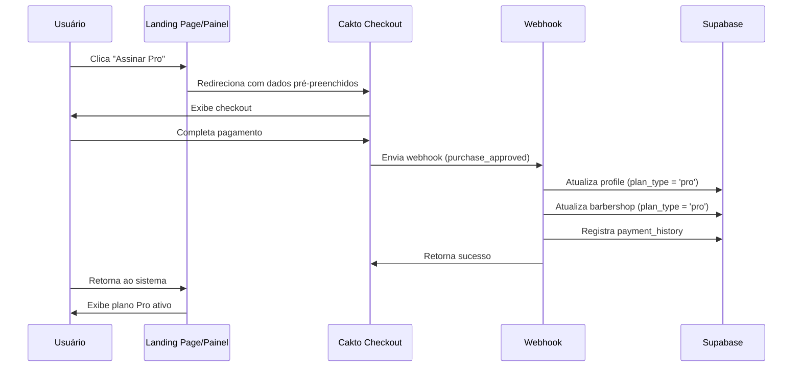

# ✅ Configuração Completa: Plano PRO com Cakto

## 📋 Resumo da Implementação

Sistema de assinatura configurado com links de pagamento diretos do Cakto para os planos Starter e Pro.

---

## 🔗 Links de Pagamento Configurados

### Plano Starter (R$ 49,90/mês)
```
https://pay.cakto.com.br/3th8tvh
```
- **Offer ID**: `3th8tvh`
- **Preço**: R$ 49,90/mês
- **Recursos**: WhatsApp integrado, mensagens automáticas, gestão de clientes, lembretes automáticos

### Plano Pro (R$ 99,90/mês)
```
https://pay.cakto.com.br/9jk3ref
```
- **Offer ID**: `9jk3ref`
- **Preço**: R$ 99,90/mês
- **Recursos**: Tudo do Starter + até 10 barbeiros, agenda individual, cliente escolhe barbeiro, relatórios por profissional

---

## 📁 Arquivos Atualizados

### 1. Landing Page (`src/pages/HomeNew.tsx`)
✅ **Alterações:**
- Plano "Premium" renomeado para "Starter"
- Plano "Pro" ativado (removido badge "EM BREVE")
- Links de pagamento adicionados aos cards
- Botões redirecionam para checkout do Cakto

```tsx
{
  name: "Starter",
  price: "49,90",
  paymentLink: "https://pay.cakto.com.br/3th8tvh"
},
{
  name: "Pro",
  price: "69,90",
  paymentLink: "https://pay.cakto.com.br/9jk3ref"
}
```

### 2. Página de Planos (`src/pages/Plan.tsx`)
✅ **Alterações:**
- Badge "EM BREVE" removido do plano Pro
- Botão "Assinar Pro" ativado
- Preço atualizado para R$ 69,90/mês
- Recursos do plano Pro atualizados

### 3. Webhook Cakto (`api/webhooks/cakto.js`)
✅ **Alterações:**
- Evento `subscription_created` adicionado ao processamento
- Mapeamento correto dos offer IDs:
  - `3th8tvh` → `starter`
  - `9jk3ref` → `pro`

```javascript
case 'purchase_approved':
case 'subscription_created':
  result = await processPaymentApproved(webhookData);
  break;
```

### 4. Hook de Checkout (`src/hooks/useCaktoCheckout.ts`)
✅ **Já configurado:**
- URLs de checkout com variáveis de ambiente
- Fallback para links hardcoded
- Pré-preenchimento automático de dados do usuário
- Suporte mobile e desktop

---

## 🔧 Variáveis de Ambiente

### Arquivo `.env` (Opcional)
```env
# Cakto Checkout URLs
VITE_CAKTO_CHECKOUT_STARTER=https://pay.cakto.com.br/3th8tvh
VITE_CAKTO_CHECKOUT_PRO=https://pay.cakto.com.br/9jk3ref

# Cakto Webhook
CAKTO_WEBHOOK_SECRET=8cd2a0f6-5a9a-43fb-932c-ebaafbefa7df
CAKTO_PRODUCT_ID_STARTER=3th8tvh
CAKTO_PRODUCT_ID_PRO=9jk3ref
```

**Nota:** Se as variáveis não estiverem definidas, o sistema usa os links hardcoded como fallback.

---

## 🧪 Como Testar

### 1. Testar Landing Page
1. Acessar: `http://localhost:5173/`
2. Rolar até a seção "Planos"
3. Verificar:
   - ✅ Card "Starter" com preço R$ 49,90 (1 profissional)
   - ✅ Card "Pro" com preço R$ 99,90 (até 10 barbeiros)
   - ✅ Botão "Assinar Starter" funcional
   - ✅ Botão "Assinar Pro" funcional (sem "EM BREVE")
4. Clicar nos botões deve abrir o checkout do Cakto

### 2. Testar Página de Planos (Painel)
1. Fazer login no sistema
2. Acessar: `http://localhost:5173/plan`
3. Verificar:
   - ✅ Plano atual exibido corretamente
   - ✅ Cards de comparação de planos
   - ✅ Botão "Assinar Agora" para Starter
   - ✅ Botão "Assinar Agora" para Pro (sem "EM BREVE")
4. Clicar em "Assinar Agora" deve:
   - Abrir checkout do Cakto em nova aba (desktop)
   - Redirecionar para checkout (mobile)
   - Pré-preencher email e dados do usuário

### 3. Testar Webhook (Simulação)

#### Teste Local com cURL:

**Teste Plano Starter:**
```bash
curl -X POST http://localhost:3001/api/webhooks/cakto \
  -H "Content-Type: application/json" \
  -d '{
    "event": "purchase_approved",
    "secret": "8cd2a0f6-5a9a-43fb-932c-ebaafbefa7df",
    "data": {
      "id": "test_starter_123",
      "customer": {
        "email": "teste@exemplo.com",
        "name": "Teste Starter"
      },
      "amount": 49.90,
      "status": "paid",
      "paymentMethod": "pix",
      "offer": {
        "id": "3th8tvh"
      }
    }
  }'
```

**Teste Plano Pro:**
```bash
curl -X POST http://localhost:3001/api/webhooks/cakto \
  -H "Content-Type: application/json" \
  -d '{
    "event": "purchase_approved",
    "secret": "8cd2a0f6-5a9a-43fb-932c-ebaafbefa7df",
    "data": {
      "id": "test_pro_123",
      "customer": {
        "email": "teste@exemplo.com",
        "name": "Teste Pro"
      },
      "amount": 69.90,
      "status": "paid",
      "paymentMethod": "pix",
      "offer": {
        "id": "9jk3ref"
      }
    }
  }'
```

#### Verificar no Supabase:
```sql
-- Ver últimos webhooks recebidos
SELECT 
  event_type,
  status,
  payload->>'data'->>'offer'->>'id' as offer_id,
  created_at
FROM webhook_logs
ORDER BY created_at DESC
LIMIT 5;

-- Ver plano do usuário
SELECT 
  email,
  plan_type,
  subscription_status,
  last_payment_date
FROM profiles
WHERE email = 'teste@exemplo.com';

-- Ver histórico de pagamentos
SELECT 
  transaction_id,
  amount,
  status,
  plan_type,
  payment_method,
  created_at
FROM payment_history
ORDER BY created_at DESC
LIMIT 5;
```

### 4. Teste Real (Produção)

#### Passo 1: Configurar Webhook no Cakto
1. Acessar painel do Cakto
2. Ir em Configurações → Webhooks
3. Adicionar URL: `https://seu-dominio.vercel.app/api/webhooks/cakto`
4. Eventos para escutar:
   - ✅ `purchase_approved`
   - ✅ `subscription_created`
   - ✅ `subscription_cancelled`
   - ✅ `pix_generated`
   - ✅ `payment_failed`

#### Passo 2: Fazer Compra de Teste
1. Criar usuário de teste no sistema
2. Acessar página de planos
3. Clicar em "Assinar Pro"
4. Completar pagamento no Cakto (usar PIX de teste)
5. Aguardar webhook ser recebido

#### Passo 3: Verificar Ativação
1. Verificar logs do webhook no Supabase
2. Confirmar que plano foi atualizado para "pro"
3. Verificar que barbershop também foi atualizada
4. Confirmar histórico de pagamento registrado

---

## 📊 Fluxo de Pagamento



---

## 🔍 Monitoramento

### Logs do Webhook
```sql
-- Webhooks com erro
SELECT * FROM webhook_logs 
WHERE status = 'failed' 
ORDER BY created_at DESC;

-- Webhooks de hoje
SELECT 
  event_type,
  status,
  created_at
FROM webhook_logs
WHERE created_at >= CURRENT_DATE
ORDER BY created_at DESC;
```

### Assinaturas Ativas
```sql
-- Usuários com plano pago
SELECT 
  email,
  plan_type,
  subscription_status,
  last_payment_date,
  expires_at
FROM profiles
WHERE plan_type IN ('starter', 'pro')
  AND subscription_status = 'active'
ORDER BY last_payment_date DESC;
```

### Receita
```sql
-- Receita total por plano
SELECT 
  plan_type,
  COUNT(*) as total_pagamentos,
  SUM(amount) as receita_total
FROM payment_history
WHERE status = 'completed'
GROUP BY plan_type;
```

---

## ✅ Checklist de Configuração

### Frontend
- [x] Landing page atualizada com links de pagamento
- [x] Plano Pro ativado (badge "EM BREVE" removido)
- [x] Página de planos atualizada
- [x] Botões de upgrade funcionais
- [x] Redirecionamento para Cakto configurado

### Backend
- [x] Webhook processando `subscription_created`
- [x] Mapeamento correto de offer IDs
- [x] Atualização de profile e barbershop
- [x] Registro de histórico de pagamento
- [x] Logs de webhook funcionando

### Banco de Dados
- [x] Tabela `webhook_logs` criada
- [x] Tabela `payment_history` criada
- [x] Tabela `profiles` com campos de assinatura
- [x] RLS policies configuradas

### Cakto
- [ ] Webhook URL configurada no painel
- [ ] Eventos selecionados
- [ ] Secret configurado
- [ ] Teste de webhook realizado

---

## 🚀 Próximos Passos

1. **Deploy do Webhook**
   - Fazer deploy da API no Vercel
   - Configurar variáveis de ambiente
   - Testar webhook em produção

2. **Configurar Cakto**
   - Adicionar URL do webhook
   - Selecionar eventos
   - Fazer teste de pagamento

3. **Monitoramento**
   - Configurar alertas de falha de webhook
   - Dashboard de métricas de assinatura
   - Relatório de receita

4. **Melhorias Futuras**
   - Cancelamento de assinatura pelo painel
   - Upgrade/downgrade de plano
   - Histórico de faturas
   - Notificações de renovação

---

## 📞 Suporte

Em caso de problemas:

1. **Webhook não recebido:**
   - Verificar logs do Cakto
   - Verificar URL configurada
   - Testar com cURL

2. **Plano não atualizado:**
   - Verificar `webhook_logs` no Supabase
   - Verificar se email do Cakto = email do usuário
   - Verificar offer ID correto

3. **Erro no checkout:**
   - Verificar console do navegador
   - Verificar se usuário está logado
   - Verificar links de pagamento

---

**Status:** ✅ Configuração Completa  
**Última atualização:** 2025-11-19  
**Versão:** 2.0 - Plano Pro Ativado
